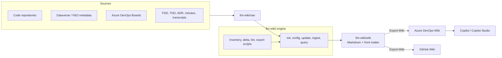

# LLM Wiki for Dynamics 365 delivery

A VS Code agent plugin that builds and maintains a **code-first project knowledge base** for Dynamics 365 projects (Customer Engagement / Power Platform and Finance & Operations). It turns source code, Dataverse and F&O metadata, Azure DevOps work items, FDD/TDD documents and meeting minutes into a cross-linked Markdown wiki, keeps documentation aligned with the implementation, and publishes it to an **Azure DevOps Wiki** or a **GitHub Wiki** where people and Copilot can query it.

- **Code is the primary source.** As-built pages are generated from repositories (Azure Repos, GitHub, local clones) and metadata; FDD and TDD describe intent. When they disagree the wiki flags `⚠️ Drift`.
- **Standard formats.** Templates for requirements (FDD), technical design (TDD), ADR, meeting minutes and code components give every project the same structure.
- **Governed content.** Every page has an owner, sources and a lifecycle (`draft -> reviewed -> certified`). The agent only writes drafts; people review and certify.
- **Low token cost.** Deterministic PowerShell scripts do inventory, change detection, lint and publishing; the LLM reads their JSON and only the files that changed.

## How it works



## Install

1. In VS Code settings enable **Chat > Plugins: Enabled**.
2. Add this repository to **Chat > Plugins: Marketplaces** (`chat.plugins.marketplaces`), using the `owner/repo` slug of this repository.
3. In the Extensions view search `@agentPlugins power-platform-llm-wiki` and install.
4. Select the **LLM Wiki** agent in the chat agent picker.

Requirements: PowerShell 7 (`pwsh`) and git. Optional, per source: Git Credential Manager (Azure Repos, Azure DevOps Wiki), `pacx`/`pac` (Dataverse), `gh` (GitHub), `markitdown` (Office/PDF documents).

## Quick start

| Step | Say to the agent                                                              | Result                                                                                                                                                     |
| ---- | ----------------------------------------------------------------------------- | ---------------------------------------------------------------------------------------------------------------------------------------------------------- |
| 1    | `init`                                                                        | Wizard: project, profiles (`power-platform`, `dynamics-fno`, `generic`), sources, publish target, governance. Creates `llm-wiki/` and installs the engine. |
| 2    | `update --source code`                                                        | Clones/pulls the repositories, runs the inventory, writes `wiki/projects/` and `wiki/code/` with Mermaid diagrams.                                         |
| 3    | drop the FDD in `llm-wiki/raw/analysis/`, then `ingest raw/analysis/fdd.docx` | One requirement page per `REQ-...`, linked to the code that implements it.                                                                                 |
| 4    | drop minutes or a transcript in `llm-wiki/raw/meetings/`, then `ingest ...`   | Meeting synthesis: decisions, action items, risks, Q&A.                                                                                                    |
| 5    | `update --lint`                                                               | Deterministic health check: links, lifecycle, traceability, overdue actions, secrets.                                                                      |
| 6    | `update --publish`                                                            | Converts and pushes the wiki to Azure DevOps Wiki or GitHub Wiki.                                                                                          |
| 7    | `query "how is the credit check implemented?"`                                | Answer grounded in wiki pages, with links and certification status.                                                                                        |

Other commands: `update --source devops|dataverse|fno|github|all`, `update --full` (incremental run of everything), `update --sprint`, `update --certify <page> --by <name>`, `config` (change settings, `--refresh-engine`, `--migrate`).

## What `init` adds to a project

```text
<project>/
├── .github/copilot-instructions.md        # LLM Wiki section (appended)
├── .github/workflows/copilot-setup-steps.yml   # only with scheduled automation (GitHub host)
├── .vscode/mcp.json                       # Azure DevOps MCP (Entra ID sign-in, no PAT), MarkItDown
└── llm-wiki/
    ├── AGENTS.md                          # operating manual (managed)
    ├── wiki.config.yml                    # project configuration
    ├── .engine/                           # managed skills, scripts, templates, profiles
    ├── .state/raw-manifest.json           # processed sources (incremental runs)
    ├── raw/                               # sources and sync dumps
    └── wiki/                              # the knowledge base
        ├── index.md  overview.md  log.md
        ├── requirements/  design/  code/  projects/  features/  delivery/
        ├── meetings/
        └── reference/{decisions,concepts,entities,sources,queries}/
```

The engine is copied into the project so that scheduled runs (Copilot cloud agent) work without the VS Code plugin. `config --refresh-engine` updates it after a plugin upgrade.

## Profiles

| Profile          | Sources                                                                                                                                  | Main `wiki/code/` pages                                                     |
| ---------------- | ---------------------------------------------------------------------------------------------------------------------------------------- | --------------------------------------------------------------------------- |
| `power-platform` | Plugins, PCF, web resources, unpacked solutions, cloud flows, pipelines; live Dataverse metadata via `pacx`                              | data model, plugins, PCF, web resources, flows, security, integrations, ALM |
| `dynamics-fno`   | Ax* metadata of custom packages: tables and extensions, classes with Chain of Command, forms, data entities, security, model descriptors | data model, extensions, classes, data entities, security, integrations, ALM |
| `generic`        | Any repository (Azure Functions, APIs, middleware)                                                                                       | architecture, one page per component, integrations, ALM                     |

## Governance

- **Lifecycle:** `draft` (agent) -> `reviewed` (`reviewed_by`) -> `certified` (`certified_by`, `certified_at`). Certification happens only on explicit request; certified pages receive a `Pending updates` section instead of being rewritten.
- **Traceability:** requirement pages carry `req_id`; code and design pages declare `implements: [REQ-...]`. The lint reports requirements without implementation evidence and untraced components.
- **Provenance:** every page lists its `sources` (raw files, work items, `repo@sha:path`).
- **Data protection:** no secrets in pages (the lint blocks common credential patterns); with `pii_redaction` only participant names and roles are kept.

## Automation

- **Host repository on GitHub:** create a Copilot cloud agent automation (repository -> Agents -> Automations) with the prompt provided by `init`; it runs `update --full` on a schedule and opens a pull request. `copilot-setup-steps.yml` prepares the tools.
- **Host repository on Azure DevOps:** run `update --full` from VS Code (manually or with a VS Code automation using the same prompt).

## Documentation

| Document | Audience |
| --- | --- |
| [docs/guida-utente.md](docs/guida-utente.md) | Project teams (Italian): installation, setup, daily use, publishing, questions, FAQ |
| [docs/governance.md](docs/governance.md) | Leads, reviewers, certifiers (Italian): roles, page lifecycle, certification, cadence, security |
| [docs/migrazione-v2-v3.md](docs/migrazione-v2-v3.md) | Projects with a v2 wiki (Italian): what changes and how to migrate |
| [CONTRIBUTING.md](CONTRIBUTING.md) | Plugin maintainers: conventions, tests, release |
| [plugins/power-platform-llm-wiki/references/AGENTS.md](plugins/power-platform-llm-wiki/references/AGENTS.md) | Operating manual installed in every project (wiki structure, page format, rules) |
| [plugins/power-platform-llm-wiki/references/publishing.md](plugins/power-platform-llm-wiki/references/publishing.md) | Publishing to Azure DevOps Wiki / GitHub Wiki |

## Repository layout

```text
.github/plugin/marketplace.json            # marketplace manifest
.github/workflows/validate.yml             # CI: validator + script tests
plugins/power-platform-llm-wiki/
├── plugin.json  .mcp.json
├── agents/llm-wiki.agent.md
├── skills/{init,config,update,ingest,query}/SKILL.md
├── scripts/                               # Install-Engine, Get-RawDelta, Get-CodeInventory, Test-WikiLint, Export-Wiki
├── templates/                             # meeting, requirement, design, adr, code-component, source
└── references/                            # AGENTS.md, publishing.md, profiles/
scripts/Validate-Plugin.ps1                # release checks (structure, versions, confidentiality)
tests/                                     # fixtures (wiki, raw, CE + F&O repo) and Invoke-Tests.ps1
docs/                                      # user guide, governance, migration (Italian)
```

## Development

```powershell
pwsh ./scripts/Validate-Plugin.ps1 -Human   # structure, versions, legacy references, confidentiality
pwsh ./tests/Invoke-Tests.ps1               # regression tests for the scripts
```

Before a release see [CONTRIBUTING.md](CONTRIBUTING.md#releasing): bump the version in `plugin.json` and `marketplace.json`, update `CHANGELOG.md`, and keep customer names, repositories and data out of the plugin.

See [CHANGELOG.md](CHANGELOG.md) for the version history.
