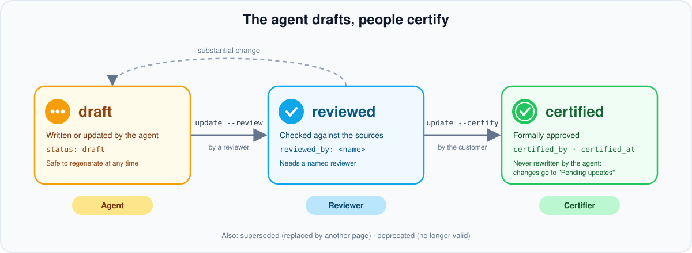

## 🛡️ Governance dei contenuti

La wiki è utile solo se ci si può fidare. Questo documento descrive ruoli, ciclo di vita delle pagine e regole che rendono i contenuti affidabili e verificabili.

  

### 🧭 Principi

|     | Principio                                                                                                                                                             |
| --- | --------------------------------------------------------------------------------------------------------------------------------------------------------------------- |
| 🧬   | **Il codice è la fonte primaria dell'as-built.** FDD e TDD descrivono l'intenzione; quando differiscono dal codice la wiki lo segnala con `⚠️ Drift` e il team decide. |
| ✍️   | **L'agente scrive solo bozze.** Revisione e certificazione sono atti umani, registrati con nome e data.                                                               |
| 🧾   | **Tutto è tracciabile.** Ogni pagina indica le fonti (`sources`): file in `raw/`, work item, commit (`repo@sha:path`).                                                |
| 🔒   | **Niente segreti, dati personali minimi.** Credenziali bloccate dal lint; dei partecipanti si riportano solo nome, organizzazione e ruolo.                            |

### 👥 Ruoli

| Ruolo                                              | Responsabilità                                                                             |
| -------------------------------------------------- | ------------------------------------------------------------------------------------------ |
| 🧭 Owner della wiki (lead Avanade)                  | Configurazione, pubblicazione, controllo periodico del lint, assegnazione delle revisioni  |
| 📌 Owner di pagina (campo `owner`)                  | Correttezza della pagina; risolve contraddizioni e drift della sua area                    |
| 🔎 Revisore                                         | Verifica una pagina rispetto alle fonti e la porta a `reviewed`                            |
| 🏅 Certificatore (cliente o responsabile designato) | Approva formalmente una pagina e la porta a `certified`; elenco in `governance.certifiers` |

### 🔄 Ciclo di vita

| Stato          | Significato                                            | Chi lo imposta                      |
| -------------- | ------------------------------------------------------ | ----------------------------------- |
| 🟡 `draft`      | Contenuto generato o modificato, non verificato        | Agente                              |
| 🔵 `reviewed`   | Verificato da un revisore (`reviewed_by`)              | Persona, tramite `update --review`  |
| 🟢 `certified`  | Approvato formalmente (`certified_by`, `certified_at`) | Persona, tramite `update --certify` |
| ⚪ `superseded` | Sostituito da un'altra pagina (collegata)              | Owner di pagina                     |
| ⚫ `deprecated` | Non più valido                                         | Owner di pagina                     |

> [!NOTE]
> Lo stato del work item o della decisione (Active, Closed, Accepted...) va nel campo `state`, non in `status`.

### 🔐 Pagine certificate

L'agente non riscrive mai una pagina certificata. Quando una nuova fonte la contraddice o la completa, aggiunge una sezione `## 🔄 Pending updates` con la modifica proposta, la fonte e un marcatore `⚠️`. L'owner di pagina decide se:

- ✅ **accettare**: la pagina torna `draft`, poi va rivista e ricertificata;
- ❌ **rifiutare**: la sezione viene rimossa e la decisione annotata nel log.

### 📅 Cadenza consigliata

| Quando                   | Attività                                                                                                                           |
| ------------------------ | ---------------------------------------------------------------------------------------------------------------------------------- |
| 🏃 A ogni sprint          | `update --full`, revisione delle pagine `draft` dello sprint, `update --sprint`                                                    |
| 🚦 Prima di UAT e go-live | Certificazione dei requisiti e delle pagine `code/` collegate; nessun errore di lint; drift chiusi                                 |
| 🗓️ Mensile                | Controllo delle pagine non aggiornate (`STL001`), delle azioni scadute (`ACT001`) e dei requisiti senza implementazione (`TRC002`) |

### 📊 Indicatori

Il lint restituisce i numeri da riportare nello stato avanzamento:

- 🟡🔵🟢 pagine per stato (`draft`, `reviewed`, `certified`);
- 📌 requisiti totali e con evidenza di implementazione;
- 🔴🟠 errori e avvisi aperti;
- ⚠️ drift segnalati (`⚠️ Drift` nelle pagine).

### 🔒 Sicurezza e riservatezza

- 🏢 La wiki vive nel repository del progetto del cliente e ne segue i permessi; la wiki pubblicata segue i permessi del progetto Azure DevOps / GitHub.
- 🔑 Nessuna credenziale nei file: Azure DevOps usa l'accesso Microsoft Entra ID, il push usa Git Credential Manager, l'automazione usa i secret del repository.
- 🚨 Il lint (`SEC001`) blocca password, chiavi e token più comuni: se scatta, rimuovi il valore e valuta la rotazione della credenziale.
- 🚫 La plugin non deve contenere nomi, repository o dati di clienti: il validatore del repository lo verifica a ogni rilascio.
