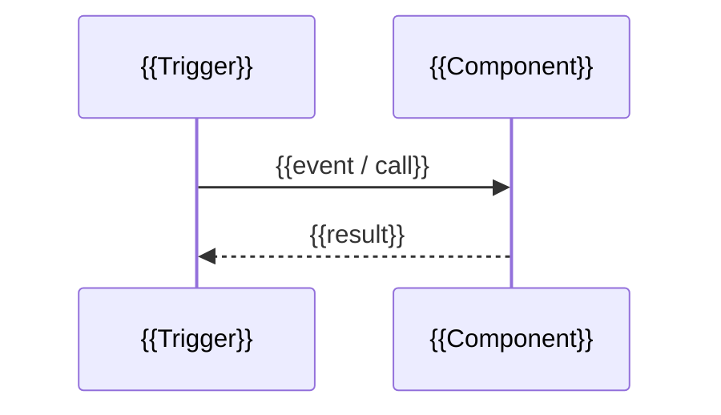

# {{Component name}}

> {{What the component does in business terms (as built, derived from the code).}}

## Responsibilities

- {{responsibility}}

## How it works

## Technical details

| Item                   | Value                                              |
| ---------------------- | -------------------------------------------------- |
| Location               | `{{path/in/repo}}`                                 |
| Trigger / registration | {{message, stage, entity / CoC method / schedule}} |
| Dependencies           | {{tables, services, configuration}}                |

## Traceability

| Requirement                                                  | Evidence                  | Notes                         |
| ------------------------------------------------------------ | ------------------------- | ----------------------------- |
| [{{REQ-AREA-NNN}}]({{../requirements/REQ-AREA-NNN-slug.md}}) | `{{file:line or method}}` | {{matches / partial / drift}} |

## Source references

- `{{repo}}@{{sha}}:{{path}}`
