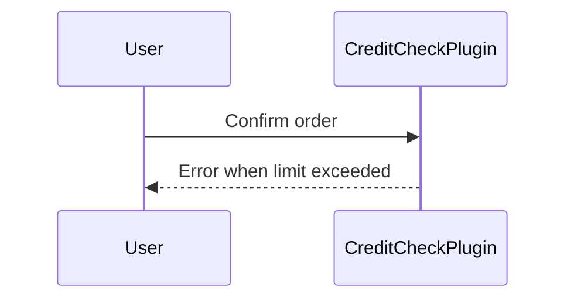

# Plugins

> Dataverse plugins of the Contoso solution.

## Credit check plugin

`CreditCheckPlugin` runs on `salesorder` update (pre-operation) and implements [REQ-SAL-001](../requirements/REQ-SAL-001-credit-check.md#acceptance-criteria).

## Diagram

